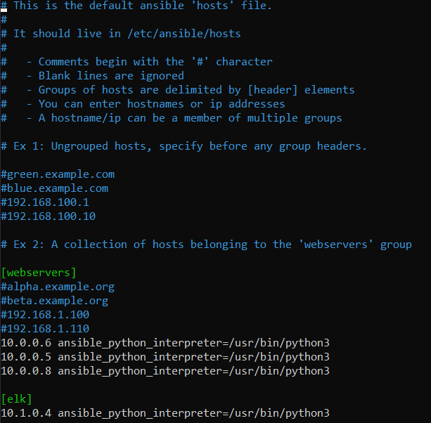

# Cyber-Program-Files
Contains scripts, configurations, and diagrams used during the Cybersecurity program at UCI
## Automated ELK Stack Deployment

The files in this repository were used to configure the network depicted below.

These files have been tested and used to generate a live ELK deployment on Azure. They can be used to either recreate the entire deployment pictured above. Alternatively, select portions of the playbook files may be used to install only certain pieces of it, such as Filebeat.

This document contains the following details:
- Description of the Topology
- Access Policies
- ELK Configuration
  - Beats in Use
  - Machines Being Monitored
- How to Use the Ansible Build

### Description of the Topology

The main purpose of this network is to expose a load-balanced and monitored instance of DVWA, the D*mn Vulnerable Web Application.

Load balancing ensures that the application will be highly available, in addition to restricting inbound access to the network. The load balancer ensures that work to process incoming traffic will be shared by both vulnerable web servers. Access controls will ensure that only authorized users — namely, ourselves — will be able to connect in the first place. The Jumpbox allows us to manage the the servers, and conatiners through docker.

Integrating an ELK server allows users to easily monitor the vulnerable VMs for changes to the file systems of the VMs on the network, and system metrics, such as CPU usage; attempted SSH logins; `sudo` escalation failures; etc.
Filebeat monitors, collects, and forwards our logs to elasticsearch for indexing.
Metricbeat monitors and analyzes the servers performance such as system CPU, memory and load, etc. This is then forwarded to elastic search for indexing.

The configuration details of each machine may be found below.

| Name     | Function | IP Address | Operating System |
|----------|----------|------------|------------------|
| Jump Box | Gateway  | 10.0.0.4   | Linux            |
| Web-1    |Web Server| 10.0.0.5   | Linux            |
| Web-2    |Web Server| 10.0.0.6   | Linux            |
| Web-3    |Web Server| 10.0.0.8   | Linux            |
| ELK      |Monitoring| 10.1.0.4   | Linux            |

### Access Policies

The machines on the internal network are not exposed to the public Internet. 

Only the Jumpbox machine can accept connections from the Internet. Access to this machine is only allowed from the following IP addresses:
`72.194.89.82`

Machines within the network can only be accessed by each other.
The only machine allowed to access the ELK VM is the JumpBox `10.0.0.4`

A summary of the access policies in place can be found in the table below.

| Name     | Publicly Accessible | Allowed IP Addresses |
|----------|---------------------|----------------------|
| Jump Box |     Yes             | 72.194.89.82         |
| ELK      |     No              | 10.0.0.4             |
| DVWA 1   |     No              | 10.0.0.4             |
| DVWA 2   |     No              | 10.0.0.4             |
| DVWA 3   |     No              | 10.0.0.4             |

### Elk Configuration

Ansible was used to automate configuration of the ELK machine. No configuration was performed manually, which is advantageous because...
Configuration with Ansible allows you to automate your applications across multiple servers on the same network.
[ELK Playbook](https://uci.bootcampcontent.com/maxcasas/casas_maximiliano/blob/master/ELK%20Stack%20Project/Files/ELK-stack-playbook.yml)

The playbook implements the following tasks:
- Configure the ELK machine to use more memory
- Install Docker to the ELK machine
- Install package manager for python
- Install Docker python module
- Download and launch the ELK container image

The following screenshot displays the result of running `docker ps` after successfully configuring the ELK instance.

### Target Machines & Beats
This ELK server is configured to monitor the following machines:
- `10.0.0.5` **Web-1**
- `10.0.0.6` **Web-2**
- `10.0.0.8` **Web-3**

We have installed the following Beats on these machines:
- **Filebeat** and **Metricbeat** `10.0.0.5`
- **Filebeat** and **Metricbeat** `10.0.0.6`
- **Filebeat** and **Metricbeat** `10.0.0.8`

These Beats allow us to collect the following information from each machine:
- **Filebeat**: Filebeat detects changes to the filesystem. Specifically, we use it to collect Apache logs.
- **MetricBeat** Metricbeat detects changes in system metrics, such as CPU usage. We use it to detect SSH login attempts, failed `sudo` escalations, and CPU/RAM statistics.

The playbook below installs Metricbeat on the target hosts. The playbook for installing Filebeat is not included, but looks essentially identical - simply replace `metricbeat` with `filebeat`, and it will work as expected.

### Using the Playbook
In order to use the playbook, you will need to have an Ansible control node already configured. Assuming you have such a control node provisioned: 

SSH into the control node and follow the steps below:
- Clone repository for correct files `git clone https://uci.bootcampcontent.com/maxcasas/casas_maximiliano/tree/master/ELK%20Stack%20Project`
- Move the configuration and playbook files into the correct directory `mv ./files/* /etc/ansible`
- Create and Configure the Hosts file `/etc/ansible/hosts` 
- Run the playbooks;
- `ansible-playbook /etc/ansible/ELK-stack-playbook.yml`
- `ansible-playbook /etc/ansible/metricbeat-playbook.yml`
- `ansible-playbook /etc/ansible/filebeat-playbook.yml`

- Then run `curl http://51.143.35.76:5601/app/kibana`. If the installation worked, this command should print HTML to the console.

